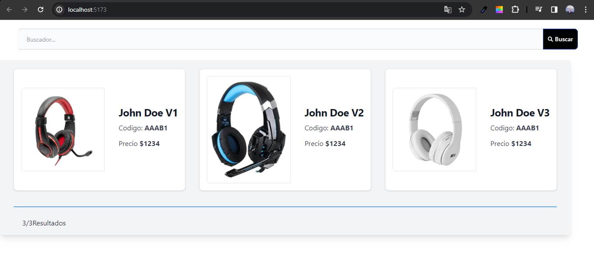

# Instrucciones del cahllenge

Según el diseño de figma, plasmar en código, un listado de productos con 
búsqueda por descripción y código de producto.
Los productos pueden venir de un array o un archivo json.
Simular un tiempo de respuesta de 3 segundos con un setTimeOut
Se valora el manejo de estados entre componentes, uso de hooks y estilos.

### Diseño:
- 📜 El diseño se encuetra aquí👉 [Figma](https://www.figma.com/file/D3jw2OCgmuxMm3YlRo2DPe/Untitled?node-id=0%3A1&t=xOD5k4nlkDXczbV4-0)
#
#
#
#
# Frontend Developer Challenge

<h2 id="demo">Vista previa de la aplicación</h2>

<h1 align="center">
  
</h1>

<!-- Puedes ver la aplicación en producción [Aquí](https://pn2611xt-3000.brs.devtunnels.ms/) -->

<h1 id="requirements">Requisitos</h1>

Antes de comenzar, es necesario instalar en sus máquinas las siguientes herramientas:
[Git](https://git-scm.com), [Node.js](https://nodejs.org/en/).
Además de eso, es bueno tener un buen editor de código como [VSCode](https://code.visualstudio.com/)

## 🎲 Ejecutando la aplicación

```bash
# Clone this repository
$ git clone <https://github.com/PedroFedeCasillas/challengens-grads/tree/main/challenge-front-dev>

# Access the project folder using terminal/cmd
$ cd challenge-front-dev

# Install the dependencies
$ npm install

# Execute the application on development mode
$ npm run dev

```

<h1 id="technologies">🛠 Tecnologias</h1>

En este proyecto se utilizaron las siguientes herramientas:

- [React](https://pt-br.reactjs.org/)
- [Vite](https://vitejs.dev/)
- [Tailwind](https://tailwindcss.com/)

<h1 id="author">🛠 Autor</h1>

<a href="https://github.com/PedroFedeCasillas/">
 
 <br />
 <sub><b>Pedro federido Casillas</b></sub></a> <a href="https://github.com/PedroFedeCasillas" title="Pedro Fede">🚀</a>

Hecho con ❤️ por Pedro Fede Casillas

👋🏽 Contactos!

<a href="https://pedrofedecasillas-website.netlify.app/">Portafolio<a> |
<a href="https://www.linkedin.com/in/pedro-fede-casillas-dev/">Linkedin<a> 
