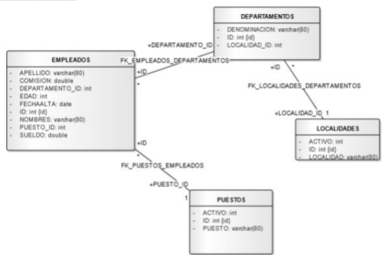

# Challenge lógica, quiery base de datos

1. Crear un algoritmo que muestre los números impares entre el 0 y el 100.

2. Realizar un programa que ingrese los sueldos de 5 operarios en un vector.
Realizar la creación y carga del vector en el constructor. Crear un método para
imprimir el vector.

3. Plantear una clase llamada Alumno y definir como atributos su nombre y su
edad. En el constructor realizar el ingreso de datos. Definir otros dos métodos
para imprimir los datos ingresados y un mensaje si es mayor o no de edad (edad >= 18)

4. JavaScript ES6: Dados los siguientes array, imprimir por consola los elementos
del array “y” que no se encuentran en el array “x” utilizando para tal fin una
única línea de código. const x = ["n", "bro", "c", "|"]; const y = ["d", "n", "l",
"bro", "g"];

5. Dada la siguiente base de datos relacional: RESUELVA LAS SIGUIENTES
CONSULTAS EN SQL:

● Mostrar los nombres de los empleados ordenados alfabéticamente (Z...A)

● Seleccionar el nombre, puesto y la localidad donde trabajan los empleados con puesto de
‘Soporte’.

● Listar los nombres de los empleados cuyo nombre termine con la letra ‘o’.

● Seleccionar el nombre, puesto y sueldo de los empleados que trabajan en la localidad Carlos Paz.

● Seleccionar el nombre, sueldo y localidad donde trabajan los empleados que tengan un
sueldo entre 10000 y 13000.

● Visualizar los departamentos con más de 5 empleados.

● Nombre de los empleados que trabajan en Córdoba y cuyo puesto sea ‘Analista’ o
‘Programador’.

● Calcula el sueldo medio de todos los empleados.

● ¿Cuál es el máximo sueldo de los empleados del departamento 10?

● Calcula el sueldo mínimo de los empleados del departamento ‘Soporte’.

● Para cada puesto obtener la suma de sueldos.